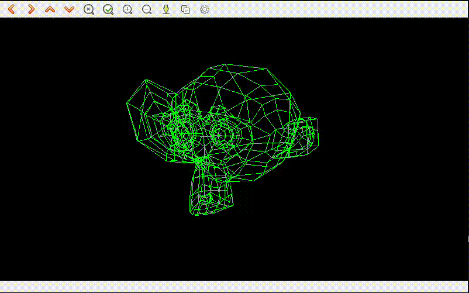

# Pinhole Camera Model Simulation


This project is a C++ implementation of a 3D-to-2D projection engine. It focuses on the mathematical foundations of the Pinhole Camera Model, developed as a first-principles exercise for autonomous systems and robotics.

## Key Features
- **Mathematical Core**: Direct implementation of Intrinsic ($K$) and Extrinsic ($R, t$) matrices via Eigen.
- **Decoupled Architecture**: Abstract Visualizer interface for API-independent rendering.
- **Dynamic Orbit**: Real-time camera transformation and perspective simulation.

## Technical Stack
- **C++17**: Utilizing for memory management.
- **Eigen3**: Linear algebra operations.
- **OpenCV**: Visualization backend.
- **CMake**: Build automation.

## Simulation Preview


## Usage
```bash
mkdir build && cd build
cmake .. && make
./Pinhole-Camera-Model --graphic-engine opencv
```

## Roadmap
- [x] Core Pinhole Engine & OpenCV Integration (2026-02-06)
- [x] 3D Model Loading (Assimp integration for .obj/.fbx) (2026-02-07)
- [ ] Manual Orbit Control (Interactive camera movement)
- [ ] Basic Shading (Face and light calculations)
- [ ] Alternative Renderers (OpenGL/Vulkan implementations)

## License
Licensed under the MIT License.
